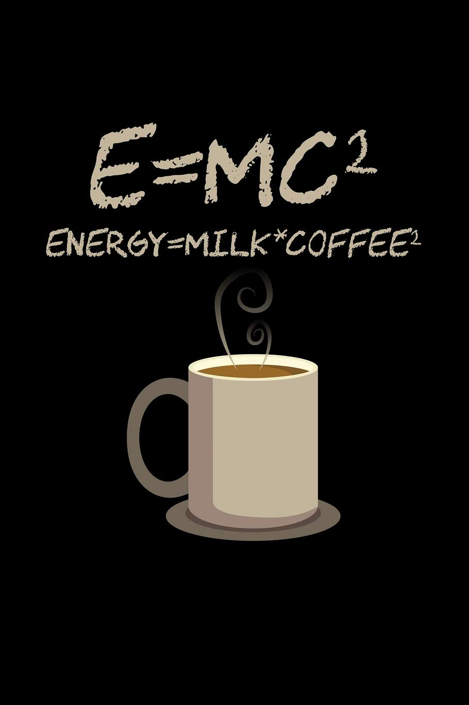

# **Hey Welcome!**

## What is This Place?

Ever wonder if the problem you have can be solved using statistics? The field of statistics and data science has grown rapidly over recent years. With buzz words like Artificial intelligence and machine learning, one can't help but wonder what the field can offer them. Whether it be for personal benefit or business-driven, everyone wants a piece of the pie. This website covers some of my journey to achieving my goal of becoming a data scientist. 

## Site Navigation

Clicking on the tabs at the top, you can go through some of the projects I have completed throughout my journey. These projects were done on my own and not assigned for credit. During or after a course, I try to apply what I have learned to a new data set. Data science and statistics is a field where you never stop learning. When coding in R, I am a big proponent of tidy data and tidy packages in general and base my workflow around them.

Data is not knowledge, knowledge is not wisdom...

